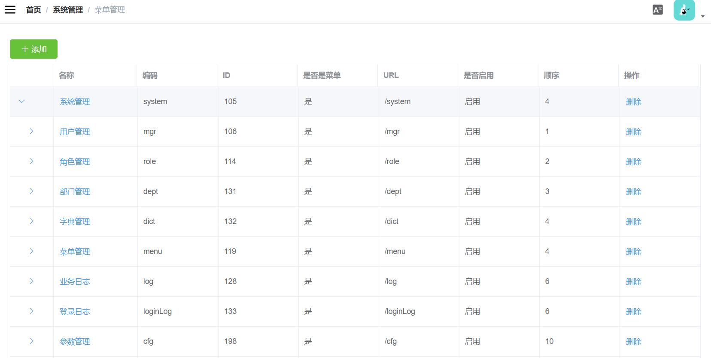
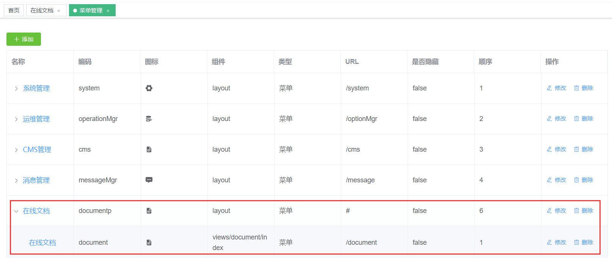

# 菜单管理

菜单管理包含两部分：一个是左侧菜单树的维护，一个是页面操作功能（主要是按钮）的维护。
不管是左侧菜单还是按钮，都需要在角色中进行配置才能正常显示出来。

先看下菜单列表大致了解下菜单管理都维护哪些内容：

## 左侧菜单维护
- 菜单维护基本上采用了两级菜单形式：如上图所示：第一级菜单为“系统管理”，“系统管理”中包含了“用户管理”、“角色管理”等多个二级菜单。
- 其中“系统管理”为虚拟菜单，点击“系统管理”并不会跳转到真实的页面而是展开其子菜单列表；所以虚拟菜单的请求地址应配置为“#”。
- “系统管理”下的子菜单，例如“业务日志”需要配置请求地址，比如配置为“/log”,点击“业务日志”会跳转到业务日志列表页面。
- 左侧菜单完全通过后台配置的菜单数据生成，因此配置要显示在左侧菜单树的菜单之前，先保证该菜单对应的页面已经开发好，否则配置好菜单自动生成路可能会失败导致页面显示异常。

## 顶级菜单
- 左侧菜单默认采用二级菜单的模式，一级菜单为一个菜单目录，二级菜单为真实的菜单，菜单管理中配置的时候可以配置第三级，第三级一般配置为页面按钮，用于页面按钮的权限控制。
- 如果需要将一个菜单置为顶级菜单，也就是第一级就可以点击到具体的页面，则可以通过下面步骤进行配置
    - 首先一个顶级菜单依然需要配置为两个层级的菜单
    - 保证一个顶级菜单下面只有一个二级菜单，则生成左侧菜单树的时候会自动将该一级菜单下的二级菜单展示为一级菜单。如果觉得有点绕，请看下图示例：
    - 菜单管理中做如下配置：
    
    - 实际效果如下：
    

**注意**
- 本项目采用i18n国际化，左侧菜单的名称并没有使用上面配置的菜单名称，而是根据上面配置的菜单编码对应的国际化资源文件中的具体值：flash-vue-admin/src/lang/zh.js（en.js).
- 如果不想使用国际化，想直接从数据库中获取菜单名称作为左侧菜单树的名称，参考MenuService类中的transferRouteMenu 方法里的相关注释说明。

